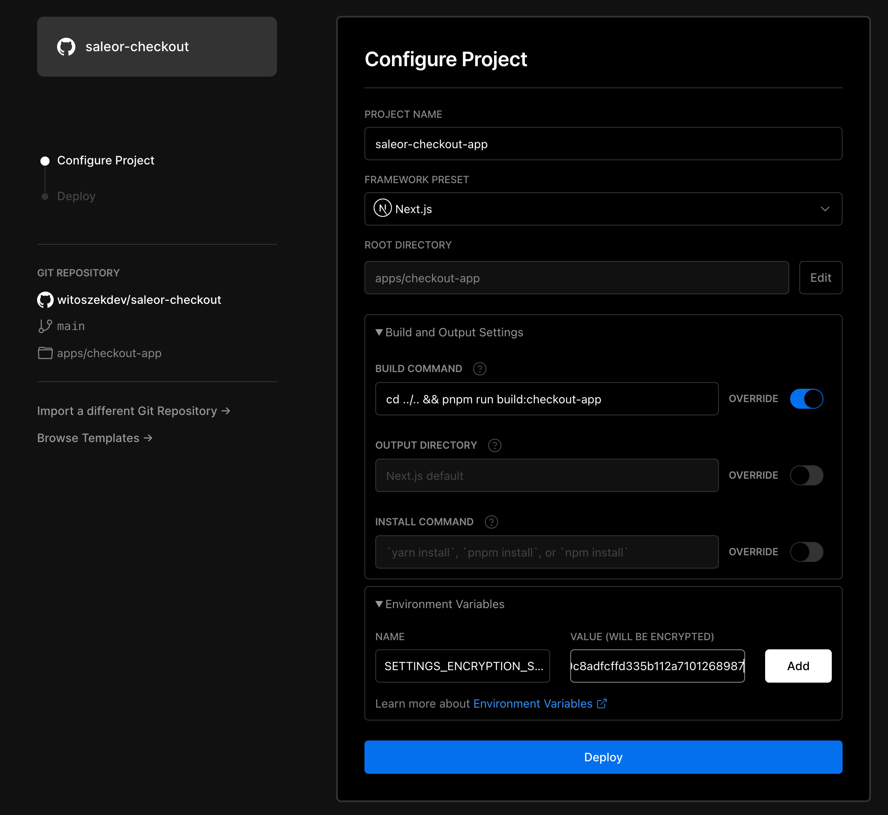

# saleor-checkout

Extensible, powerful checkout powered by Saleor API.

## Setup

This monorepo uses [PNPM](https://pnpm.io/) as a package manager and [Turborepo](https://turborepo.org/) for building packages. 

### Monorepo structure

Here's the list of each app and shared package in the monorepo (click to see a README of that project)

#### Apps

- [`apps/checkout`](apps/checkout/README.md): a SPA React 18 checkout app, ready to be extended/modified
- [`apps/payments-app`](apps/payments-app/README.md): a Next.js checkout dashboard + payments app, ready to be extended/modified

#### Packages

- `packages/ui-kit`: UI kit for checkout and [React Storefront](https://github.com/saleor/react-storefront)
- `packages/config`: `eslint` configurations (includes `eslint-config-next` and `eslint-config-prettier`)
- `packages/tsconfig`: `tsconfig.json`s used throughout the monorepo

### Install dependencies
```
pnpm i
```

### Build

To build all apps and packages, run the following command:

```
pnpm run build
```

You can also build a specific app or package by running this command:

```bash
pnpm dlx turbo run build --filter=checkout
# or
pnpm run build:checkout
```

In this example we'll only build `apps/checkout`

### Develop

To develop all apps and packages, run the following command:

```
pnpm run dev
```

You can also run only a specific app by running this command:

```bash
pnpm dlx turbo run dev --filter=checkout
# or
cd apps/checkout && pnpm dev
```

## Deployment

### Vercel

The repo needs to be hosted on GitHub or some other git repository. Before you start, fork the repo to your account or organization.

- Authenticate the Turborepo CLI with your Vercel account

```
pnpm dlx turbo login
```

- Link the repo to a Vercel scope to enable the Remote Caching feature

```
pnpm dlx turbo link
```

> Remote Caching drastically reduces build times if you work in a team. Learn more about it at [Turborepo documentation](https://turborepo.org/docs/core-concepts/remote-caching) and [Vercel documentation](https://vercel.com/docs/concepts/monorepos/remote-caching)

#### Payments App

1. Start [creating new project](https://vercel.com/docs/concepts/projects/overview#creating-a-project) on Vercel and select your forked GitHub repo

> Note: Vercel now doesn't support importing the entire monorepo, you will need to set up a project yourself for each app inside `/apps` folder


2. From the configuration page:
  - Provide your project name (for example `saleor-payments-app`)
  - Select framework to Next.js
  - Choose the root directory to be `apps/payments-app`
  - Override the build command to:

```bash
cd ../.. && pnpm run build:payments-app
```

  - Add environment variables:
    - `NEXT_PUBLIC_SALEOR_API_URL` — URL of your Saleor GraphQL API endpoint
    - `SETTINGS_ENCRYPTION_SECRET` — Random string used for encrypting apps configuration (you can generate it using `openssl rand -hex 256`)

Here's the final result on configuration page:



Click deploy and wait until the app is deployed

3. Install the app in Saleor

Grab the deployed app URL from Vercel and add `/api/manifest`. This URL points to the manifest file that is required for installing the app in Saleor

> Example manifest URL:
> ```
> https://saleor-payments-xyz-myusername.vercel.app/api/manifest
> ```

You can install the app by using:

- [Saleor Dashboard](https://github.com/saleor/saleor-dashboard)

```
http://<YOUR_SALEOR_URL>/dashboard/apps/install?manifestUrl=<YOUR_MANIFEST_URL>
```

- [Saleor CLI](https://github.com/saleor/saleor-cli)

```
saleor app install
```

- [Saleor Core manage.py script](https://docs.saleor.io/docs/3.x/developer/extending/apps/installing-apps#installing-third-party-apps)
- [Saleor GraphQL API](https://docs.saleor.io/docs/3.x/developer/extending/apps/installing-apps#installation-using-graphql-api)

4. Generate app token

After the app was installed generate it's `authToken`

- [Saleor CLI](https://github.com/saleor/saleor-cli)

```
saleor app token
```

- [Saleor GraphQL API](https://docs.saleor.io/docs/3.x/developer/api-reference/mutations/app-token-create)

```graphql
mutation {
  appTokenCreate(input: {name: "Vercel", app: "<MY_APP_ID>"}) {
    authToken
  }
}
```

Where `<MY_APP_ID>` is the app id. You can retrieve the id by using this GraphQL query:

```graphql
query {
  apps(first: 10) {
    edges {
      node {
        id
        name
      }
    }
  }
}
```

outputs this:
```jsonc
{
  "data": {
    "apps": {
      "edges": [
        {
          "node": {
            "id": "QXBwOjQ=", // <- this is the app id
            "name": "Checkout"
          }
        }
      ]
    }
  },
}
```

5. Update environment variables in Vercel

You have to add additional environment variables for Payments App in Vercel:
- `SALEOR_APP_ID` — ID of the app
- `SALEOR_APP_TOKEN` — Token you've just generated

Make sure that you also have "Automatically expose System Environment Variables" selected

Here's how the configuration should look like in the end:


After you're done re-deploy the app

6. 🥳 Congrats! Payment app is now ready to be used!

#### Checkout

1. Start by creating another project on Vercel, just like we did in [Payments App setup](#payments-app), select the same repository

2. On the configuration page:
  - Provide your project name (for example `saleor-checkout`)
  - Select framework to Create React App
  - Choose the root directory to be `apps/checkout`
  - Override the build command to:

```bash
cd ../.. && pnpm run build:checkout
```

  - Add environment variables:
    - `REACT_APP_CHECKOUT_APP_URL` — URL of the deployed [Payments App](#payments-app) API root. For example:
```
https://saleor-payments-app.vercel.app/api
```
    - `REACT_APP_SALEOR_API_URL` - URL of Saleor GraphQL API endpoint

Here's the final result on configuration page:


Click deploy and wait until the app is deployed
